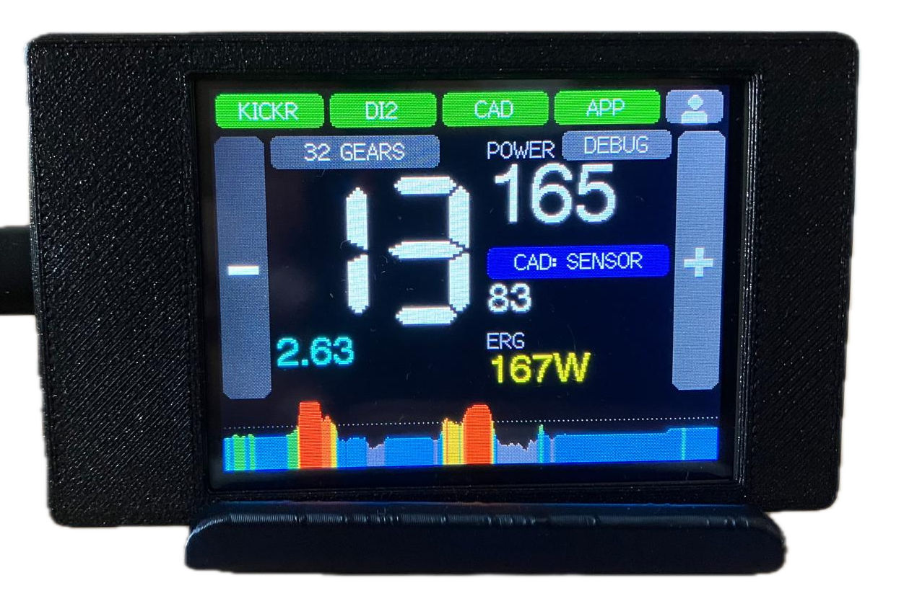

# CYD Virtual Shifter

**Virtual shifting for the Wahoo KICKR v5, using your Shimano Di2 hood buttons,
on a ~€15 ESP32 touchscreen.** No phone app to keep running and no Zwift Click:
the Cheap Yellow Display sits between the trainer and Zwift or MyWhoosh, turns
your Di2 button presses into virtual gears, and shows your ride on its own
screen.



## Why

The KICKR v5 (2020) never got virtual shifting. Wahoo ruled out Zwift's
virtual shifting for the v4/v5, and the v5 doesn't speak FTMS either, so no
training app can shift gears on it. The only way is to sit between the trainer
and the app. This firmware does that on a board that costs less than a
cassette, with a screen you can mount on the bars.

```
  KICKR v5  <--BLE-->  CYD  <--BLE-->  Zwift / MyWhoosh
                        ^                (sees an FTMS trainer
          +-------------+----------+      called "CYDShift")
          |                        |
   Di2 hood buttons         BLE cadence sensor
    (D-Fly channels)           (optional)
```

The chain stays in one gear on the real bike (34/17 by default). A virtual
gear is a gear ratio, applied by telling the trainer's own sim physics that the
wheel is bigger or smaller than it is. At the same cadence a bigger virtual
wheel means a faster virtual road, which is exactly what a bigger gear does.
The app's gradient goes to the trainer untouched, so hills still feel like
hills in every gear.

## Features

- **Shift with the Di2 hood buttons** you already have, over Shimano's D-Fly
  channels. A double-press shifts two gears. The big `−`/`+` buttons down the
  screen edges do the same, and repeat when held.
- **Two gear sets:**
  - **16 gears** walk a real Shimano Ultegra 50/34 × 11-34 12-speed: all nine
    small-ring cogs, one front shift, then the big ring. That's the same single
    crossover Di2 synchronized shift uses, rather than a zig-zag through
    overlapping ratios.
  - **32 gears** spread ratios 0.50 to 6.00 in equal steps, wider than any
    real 2x at both ends.
  - Switching between them lands on the nearest ratio, so the resistance
    doesn't jump.
- **Works with any app that controls an FTMS trainer.** It's tested with
  **Zwift** and **MyWhoosh**, in free riding (sim) and ERG workouts. The
  shifting is the same in every app, because the app never knows about gears.
- **ERG passes straight through.** The trainer holds the workout's target and
  the gears step aside. The firmware also handles two things that break ERG
  otherwise:
  - MyWhoosh's way of switching ERG off and on;
  - the KICKR stalling if it's put into ERG while the flywheel is stopped.
- **Cadence from a BLE sensor**, if you have one. The sensor's cadence goes to
  the app too, not just the screen. If the sensor drops out mid-ride, the
  trainer's own cadence is used instead, and the screen shows that it happened.
- **Real numbers.** Power is the trainer's own measurement, and cadence comes
  from the trainer or your sensor. Nothing is estimated or faked.
- **A live power graph** of the last five minutes in Zwift's zone colours,
  scaled to your FTP.
- **Rider profile on the device:** rider and bike weight, FTP, wheel
  circumference and height, set on the touchscreen and remembered across power
  cycles.
- **A debug screen** that shows both Bluetooth conversations live, for when
  something doesn't behave.

## The ride screen

| On screen | What it tells you |
|---|---|
| **KICKR · DI2 · CAD · APP** | The four links: trainer, shifter, cadence sensor, training app. Green when connected, red when not. Tap any of them to open the device picker. |
| Person icon (top right) | Opens the rider profile. |
| **16 / 32 GEARS** | The gear set. Tap to switch. |
| Big number | The current gear. |
| Cyan figure | The virtual gear ratio. In 16-gear mode it's shown with the nearest real chainring × cog, e.g. `34x14 2.43`. |
| **POWER** | Instant power from the trainer, in watts. |
| **DEBUG** | Opens the debug screen. |
| **CAD: SENSOR / TRAINER** | Where cadence comes from. Tap to switch. It turns amber (`NO SENSOR`) if the chosen sensor went quiet and the trainer's cadence is being used instead. The number underneath is your cadence in rpm. |
| **GRADE** or **ERG** | In sim, the gradient the trainer is riding. In an ERG workout, the target wattage. |
| `−` / `+` | Easier / harder. The same as the Di2 buttons. |
| Power graph | One column per second for the last five minutes, newest on the right. Each is the 3-second average power, as tall as it is strong (the top edge is 150 % of FTP), in Zwift's zone colours: grey below 60 % of FTP, then blue, green from 76 %, yellow from 90 %, orange from 105 % and red from 119 %. The dotted line is FTP. |

The other screens:

- **Device picker.** It lists what's advertising nearby, each tagged with its
  likely role. Tap a row to connect it, and hold a row to forget it. Chosen
  devices reconnect by themselves on every boot.
- **Profile.** Each value has `−`/`+`; hold for faster steps. Changes are saved
  and sent to the trainer when you go back to the ride screen.
- **Debug.** It shows every field of the trainer's power packets, every command
  the app sends, the last value sent with each trainer command and whether the
  trainer accepted it, and what goes back to the app.

## What you need

- **A Cheap Yellow Display, ESP32-2432S028R.** Get the variant with **two USB
  ports** (micro-USB and USB-C) and the ST7789 panel. The original single-port
  version has a different display controller and needs its own display
  settings, which aren't included here.
- **A Wahoo KICKR v5 (2020).** This is the only trainer it has been tested
  with. It talks Wahoo's own control protocol, so other trainers aren't
  supported.
- **Shimano Di2 with D-Fly** (tested with 12-speed R8150), set up in the
  E-TUBE PROJECT app. You can also ride without Di2 and use the on-screen
  buttons.
- *Optional:* a BLE speed/cadence sensor.
- A USB power supply, and a case or bar mount for the board.

## Setup

1. **E-TUBE.** In E-TUBE PROJECT Cycling, assign the two hood-top buttons to
   **D-Fly channels**. Nothing is broadcast over Bluetooth otherwise. Channel 1
   shifts easier and channel 2 harder; swap them in `include/Config.h` if you'd
   rather have them the other way round.
2. **Flash.** Install [PlatformIO](https://platformio.org) (the CLI or the VS
   Code extension), clone this repo, connect the CYD by its **micro-USB** port
   (the USB-C port lacks the resistors some chargers need) and run:
   ```sh
   pio run -e cyd2usb -t upload
   ```
   The upload speed is deliberately pinned to 115200. Faster rates corrupt the
   transfer on this board.
3. **Pick your devices.** On first boot the CYD opens the device picker. Tap
   your KICKR, your Di2 (press a shift button to wake it if it isn't listed),
   and optionally your cadence sensor, then **RIDE >**.
4. **Pair the app.** In Zwift or MyWhoosh, pair **CYDShift** as your power
   source and controllable trainer. Don't pair the KICKR itself, or you get no
   shifting. Pair a heart-rate strap with the app directly, because it isn't
   relayed. If the app has its own virtual shifting, turn it off. It isn't
   relayed to the trainer, and you don't need it: the CYD does the shifting.
5. **Set your profile.** Tap the person icon (top right) and set your weight,
   bike weight, FTP and wheel circumference. The weights feed the trainer's sim physics, and FTP sets the
   power graph's zones.

## How it compares

Several good projects bring virtual shifting to trainers that don't have it.
They make different trade-offs:

| | **CYD Virtual Shifter** | [BikeControl](https://github.com/OpenBikeControl/bikecontrol) | [QZ (qdomyos-zwift)](https://github.com/cagnulein/qdomyos-zwift) | [SHIFTR](https://github.com/JuergenLeber/SHIFTR) | [Kickr-Virtual-Shifting](https://github.com/Berg0162/Kickr-Virtual-Shifting) |
|---|---|---|---|---|---|
| What it is | ESP32 firmware with its own touchscreen | App for Android, iOS, macOS, Windows | App for Android and iOS | ESP32 firmware (WT32-ETH01) | ESP32 Arduino library with examples |
| Needs a phone or computer running it | No | Yes | Yes | No | No |
| Trainers | Wahoo KICKR v5 | Smart trainers connected to it directly, or none - it can also drive the app's own shifting | A very wide range of bikes, treadmills, rowers and ellipticals | FE-C over BLE (Tacx NEO 2T, Vortex) | Legacy Wahoo KICKRs without virtual-shifting firmware |
| Shift with | Di2 hood buttons, on-screen buttons | Zwift Click/Play/Ride, Di2, SRAM AXS, gamepads and more | Several controllers, including Zwift's | Zwift Click / Play | Zwift Click |
| Apps | Any FTMS app; tested with Zwift and MyWhoosh | Most trainer apps | Most trainer apps | Zwift with virtual shifting; MyWhoosh without | Zwift, Rouvy |
| Where gears live | On the CYD; the app sees a normal trainer | In BikeControl, or in the app it drives | In QZ, which can follow Zwift's gear | Zwift's own virtual shifting | Zwift's own virtual shifting |

In short:

- **BikeControl or QZ** are the way to go if you'd rather not build hardware,
  have a tablet running anyway, or need to cover lots of controllers, trainers
  and apps. QZ in particular supports far more equipment than anything else
  here.
- **SHIFTR** fits a Tacx or other FE-C trainer if you want Zwift's native
  virtual shifting, plus an Ethernet connection to Zwift through Wahoo's
  Direct Connect.
- **Kickr-Virtual-Shifting** gives an older KICKR Zwift's own virtual-shifting
  experience, gear display and all, using a Zwift Click. It's a library to
  build on rather than a finished device.
- **This project** suits a KICKR v5 and Di2 rider who wants dedicated
  hardware: a screen on the bars that shifts the same way in every app, with
  nothing else to launch.

The flip side of "the app sees a normal trainer" is that the app doesn't know
your gear. In-app virtual shifting, such as Zwift's or MyWhoosh's, isn't
relayed to the trainer, so switch it off in the app. The gear lives on the
CYD's screen instead.

## Known limitations

- **Trainer:** only the KICKR v5 has been tested, and it has to stay in the
  real gear set in `include/Config.h` (34/17 by default).
- **One app at a time**, and heart rate isn't relayed.
- **ERG:** the gears do nothing in ERG, by design.
- **If the KICKR stalls:** if power ever reads 0 W while you're clearly
  pedalling in ERG, power-cycle the KICKR. The firmware avoids the known cause,
  but that's what clears it.
- **Wheel size ceiling:** the top of the 32-gear range needs almost the largest
  wheel size the trainer accepts. With a wheel circumference above about
  2184 mm, the top few gears stop at that ceiling.

## More detail

[docs/TECHNICAL.md](docs/TECHNICAL.md) covers how gears, cadence and ERG work
underneath, the settings you can tune, the Wahoo and Shimano protocol details,
and reading the serial log.

## Credits

The protocol knowledge this relies on comes from the projects compared above,
especially [qdomyos-zwift](https://github.com/cagnulein/qdomyos-zwift) and
[SHIFTR](https://github.com/JuergenLeber/SHIFTR). It's built on
[NimBLE-Arduino](https://github.com/h2zero/NimBLE-Arduino),
[TFT_eSPI](https://github.com/Bodmer/TFT_eSPI) and
[XPT2046_Touchscreen](https://github.com/PaulStoffregen/XPT2046_Touchscreen).

*Not affiliated with or endorsed by Wahoo, Shimano, Zwift or MyWhoosh. Product
names are trademarks of their owners and are used only to say what this works
with. Use at your own risk.*
